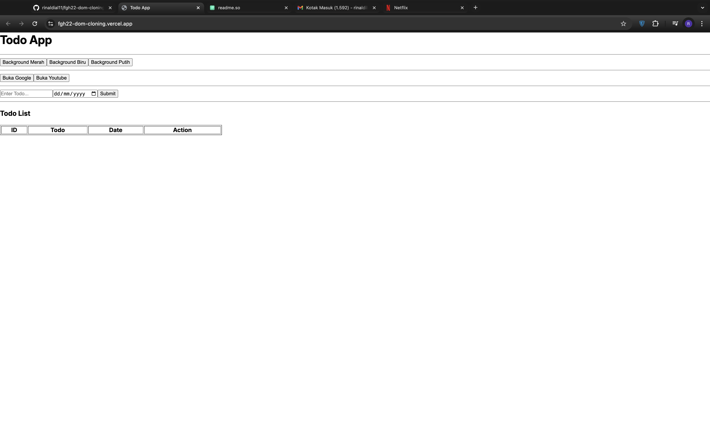

## Display

# Task DOM Cloning

Project ini ditujukan untuk talent FazzTrack untuk lebih memahami cara implementasi dasar DOM Manipulation dengan cara mengcloning tampilan semirip mungkin dengan contoh dan juga fungsi dari setiap button dan input serta tabelnya.

## Features
- Button background
Berfungsi untuk mengubah warna latar di bagian body dari web.
- Button link
Berfungsi untuk mengalihkan halaman web ke link tujuan setelah mengklik button tersebut.
- ToDo Input
Berfungsi untuk listing apa yang akan kita lakukan pada tanggal yang telah kita tentukan dan memasukan data listing ke dalam tabel.
## Authors

- [Rinaldi Ainnurrahman Lengkana](https://github.com/rinaldial11)

